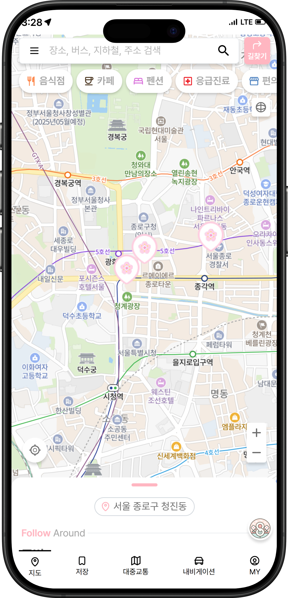
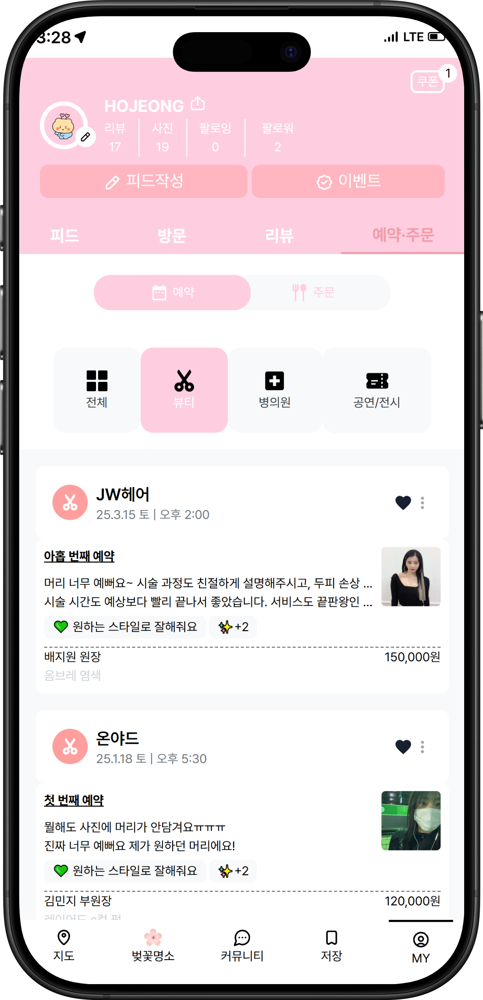
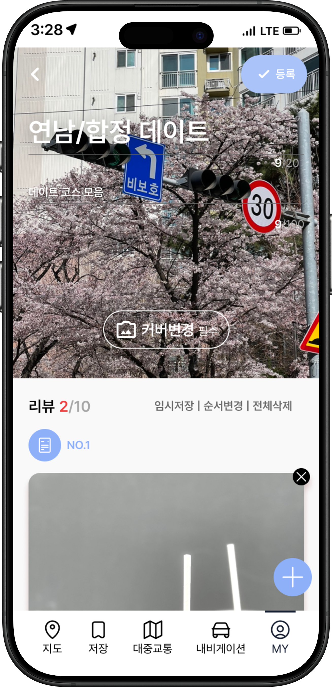

<h1 align= "center">
  🌸 8llOW ME - Re:8lace
</h1>

<h3 align= "center">
    Re: 8lace 프로젝트
</h3>

> 라이온 플레이스 시안을 기반으로 봄을 곁들여서 제작한 웹사이트입니다. 커뮤니티 기능, 벚꽃 명소, 지도 기능 등을 포함하고 있으며 HTML, Tailwind CSS, Naver Map API 등을 활용했습니다.

<h2 align= "center">
     👥 팀 소개
</h2>
<div align="center">

<table>
  <tr>
    <td align="center"></td>
    <td align="center"></td>
    <td align="center"></td>
    <td align="center"></td>
  </tr>

  <tr>
    <td align="center"><strong>조장</strong></td>
    <td align="center"><strong>조원</strong></td>
    <td align="center"><strong>조원</strong></td>
    <td align="center"><strong>조원</strong></td>
  </tr>
  <tr>
    <td align="center">이호정</td>
    <td align="center">이도울</td>
    <td align="center">이우민</td>
    <td align="center">조한솔</td>
  </tr>
  <tr>
    <td align="center">
      <a href="https://github.com/jeong0403"></a>
    </td>
    <td align="center">
      <a href="https://github.com/dooollee"></a>
    </td>
    <td align="center">
      <a href="https://github.com/woomin33"></a>
    </td>
    <td align="center">
       <a href="https://github.com/hansol65"></a>
    </td>
  </tr>
  <tr>
    <td align="center"><strong>ENFJ</strong></td>
    <td align="center"><strong>ENFP</strong></td>
    <td align="center"><strong>ISTJ</strong></td>
    <td align="center"><strong>ISTP</strong></td>
  </tr>
</table>

</div>

<h2 align= "center">
  ⚙️ 사용 기술 및 협업 도구 ⚙️
</h2>

  <div align="center">
    <table>
      <tr>
        <th>분류</th>
        <th>툴</th>
      </tr>
      <tr>
        <td><strong>언어 / 스타일</strong></td>
        <td>
          
          
          
          
        </td>
      </tr>
      <tr>
        <td><strong>개발 환경</strong></td>
        <td>
          
          
          
        </td>
      </tr>
      <tr>
        <td><strong>라이브러리</strong></td>
        <td>
          
          
          
        </td>
      </tr>
      <tr>
        <td><strong>협업 / 배포</strong></td>
        <td>
          
          
          
          
          
        </td>
      </tr>
    </table>
  </div>
  
  <h2 align= "center">
    📁 프로젝트 구조
  </h2>

```
8olloWme/
├── .github/
├── .vscode/
├── dist/
├── public/
├── src/
│   ├── assets/          # 이미지, 아이콘 등
│   ├── components/      # 공통 UI 컴포넌트
│   ├── js/              # JS 파일
│   ├── pages/           # 각 페이지별 구현
│   ├── store/
│   └── utils/sakura/    # 벚꽃 관련 유틸리티
├── index.html           # 메인 진입점
├── style.css
├── main.js
├── vite.config.js
├── package.json
├── README.md
```

---

  <h2 align= "center">
     ✨ 주요 기능
  </h2>
  
  | 기능         | 설명                                                                             |
  | ------------ | -------------------------------------------------------------------------------- |
  | 🌸 벚꽃 명소 | 지역 별 벚꽃 명소 및 봄꽃축제의 정보 및 축제 공식사이트 제공                     |
  | 🗺️ 지도 연동 | 네이버 지도 API를 활용하여 장소를 마커로 표시하고 조작 가능                      |
  | 💬 커뮤니티  | 다양한 주제의 모임을 카드 형식으로 정리한 게시판 UI                              |
  | 📱 반응형 UI | Tailwind를 활용한 모바일 최적화                                                  |
  | 🤖 AI 챗봇   | 사용자의 위치 정보 기반 추천을 도와주는 인터페이스 구성 (디자인 및 대화 UI 구현) |
  
  ---
  
  ## 🖼️ 미리보기
  
  <div aligin="center">
    
    
    
    
  </div>
  
 <h2 align= "center">
   🔄 프로젝트 플로우차트
 </h2>

> 프로젝트 진행 순서를 시각적으로 정리한 다이어그램입니다.

  
  
 <h2 align= "center">
     💭 프로젝트 소감
 </h2>
